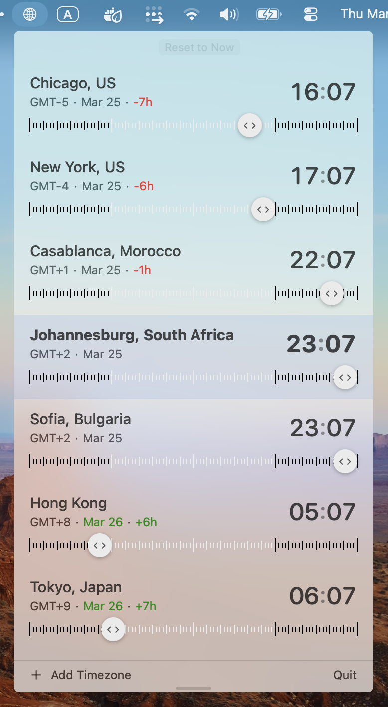

# TimeZonesMenuBarApp

A lightweight macOS menubar app for viewing multiple timezones at a glance. Inspired by [time.fyi/timezones](https://time.fyi/timezones).



## Features

- **Menubar app** — lives in your menubar, one click to open
- **Multiple timezones** — add cities from a curated list of 75+ worldwide locations with search aliases (e.g. search "cape town" finds Johannesburg, South Africa)
- **Draggable time ruler** — each city has a timeline bar with a `<>` handle you can drag to scrub through the full 24 hours, updating all cities simultaneously
- **Day/night visualization** — timeline ticks are light for daytime hours (6am-6pm) and dark for nighttime
- **Reference city** — click any city row to set it as your reference point; hour deltas and date coloring adjust relative to the selected city
- **Date indicators** — each city shows its current date, colored red if behind your reference city's day, green if ahead
- **Hour delta** — shows the offset from your reference city (e.g. `-7h`, `+1h`)
- **Auto-sorted** — cities are always ordered by UTC offset (west to east)
- **Blinking colon** — subtle animated colon separator in the time display
- **Resizable panel** — drag the bottom handle to adjust the panel height; your preference is saved across launches
- **Persistent settings** — your timezone list and panel height are saved via UserDefaults
- **Reset to Now** — one-click reset when you've scrubbed away from the current time

## Requirements

- macOS 13.0 or later
- Apple Silicon (arm64)

## Build

```bash
./build.sh
```

This compiles the Swift source files and creates `World Clock.app`.

## Run

```bash
open 'World Clock.app'
```

A globe icon will appear in your menubar. Click it to open the timezone panel.

## Usage

- **Add a timezone** — click "+ Add Timezone" at the bottom, search by city name, country, or alias
- **Remove a timezone** — right-click a city row and select "Remove"
- **Scrub time** — drag the `<>` circle on any city's timeline bar
- **Change reference city** — click any city row to highlight it and reorient all deltas
- **Reset** — click "Reset to Now" to return to the current time
- **Resize** — drag the handle at the very bottom of the panel
